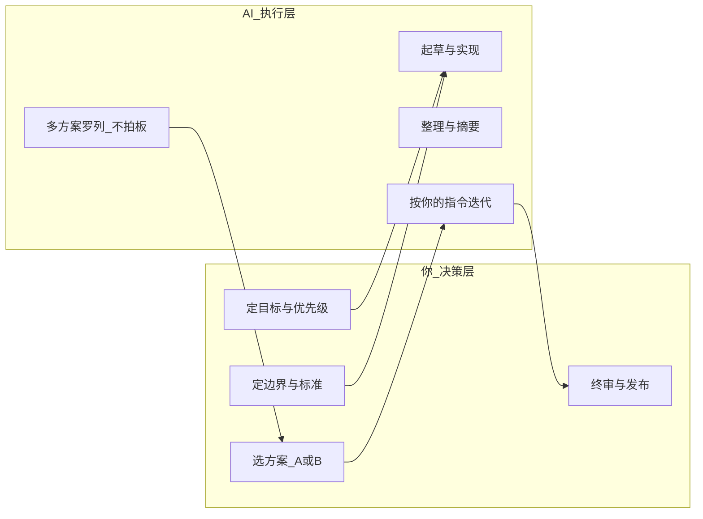

# 决策-执行分工模型

> **核心原则：你决策，AI 执行。**  
> AI 负责把已决定的事做完；你不确定的，先决策再交给 AI，不让 AI 替你做选择。

---

## 一、谁做什么



| 层级 | 你（决策） | AI（执行） |
|------|------------|------------|
| **目标** | 要不要做、做到什么程度 | — |
| **方案** | 从 AI 给的选项里 **选一个** | 列出 2–3 方案 + 利弊，**不推荐默认**（除非你要求） |
| **边界** | 做什么 / 不做什么 / 截止时间 | 严格遵守，不自行扩 scope |
| **标准** | 什么叫「完成」、什么叫「合格」 | 按标准交付，不达标继续改 |
| **内容** | 关键结论、数字、对外口径 | 扩写、润色、格式化 |
| **代码** | 架构方向、merge 与否 | 写代码、测试、重构、Review 初筛 |
| **发布** | 最终发送 / 上线 | — |

---

## 二、标准交互格式：执行简报（Execution Brief）

**每次交给 AI 任务，先用 30 秒填这个结构**（可复制到任何 Prompt 顶部）：

```
【决策-执行简报】
决策（我已确定，请执行）：
- 目标：
- 选定方案：（若已从多方案中选好，写 A/B/C）
- 完成标准：（3 条以内，可验收）
- 边界/禁止：
- 截止时间/篇幅：

素材：
【粘贴】

输出要求：
- 格式：
- 语气/受众：
```

AI 的回复应 **直接交付**，而不是再问你「你想怎么做？」——除非遇到简报里未覆盖的阻塞项。

---

## 三、各场景分工速查

### 生活

| 场景 | 你决策 | AI 执行 |
|------|--------|---------|
| L1 信息整理 | 哪些值得深读、行动项做不做 | 摘要、提取 action、归类 |
| L2 写作沟通 | 核心观点、发不发、发给谁 | 起草、润色、缩短 |
| L3 学习 | 学什么、掌握到什么程度 | 提纲、答疑、出题自测 |

### 工作办公

| 场景 | 你决策 | AI 执行 |
|------|--------|---------|
| W1 会议纪要 | action owner、优先级、是否对外 | 结构化纪要、表格 |
| W2 报告 | 结论、数据、要传递的态度 | 大纲、初稿、PPT 骨架 |
| 需求 | 做不做、MVP 范围 | 澄清问题清单、PRD 骨架 |

### 研发

| 场景 | 你决策 | AI 执行 |
|------|--------|---------|
| 功能 | 做哪个、验收标准、能否 merge | 实现、测试、Review 初筛 |
| 架构 | 选哪种方案 | 写 POC、列对比表 |
| 排障 | 采纳哪个假设 | 日志摘要、列假设、写 patch |

### 业务 MVP

| 场景 | 你决策 | AI 执行 |
|------|--------|---------|
| 场景 | 做哪个 MVP、试点谁 | 文档分块、评估集、回答生成 |
| 质量 | 准确率够不够上线 | 调 prompt、检索优化 |

---

## 四、三种 Prompt 模式

### 模式 1：纯执行（最常用，占 80%）

你已决定，AI 只干活。

```
按以下决策执行，不要给建议、不要反问，除非缺少阻塞信息。

【粘贴 决策-执行简报】
```

模板文件：[`prompts/execution-brief.md`](prompts/execution-brief.md)

### 模式 2：选项陈列（你要做选择时）

AI 列选项，**你选**，然后切回模式 1。

```
列出 2–3 个可行方案，每个：做法 / 利弊 / 工作量。
不要推荐默认选项。我选完后再执行。
```

### 模式 3：审查（交付前）

AI 已执行完，你做终审。

```
以下是我要发布的 [内容/代码描述]。
只检查：事实错误、遗漏、风险、与「完成标准」的差距。
输出 Must fix 清单，不要重写全文。
```

---

## 五、避免的反模式

| 反模式 | 问题 | 改法 |
|--------|------|------|
| 把模糊想法丢给 AI「你看着办」 | AI 猜你的意图，返工多 | 先填执行简报 |
| 让 AI 选方案还直接执行 | 方向错，浪费执行 token | 模式 2 → 你选 → 模式 1 |
| AI 起草 = 可以不发就发 | 质量/合规风险 | 保留 D4 终审 |
| 每个小事都自己写细节 | 没发挥 AI 执行优势 | 你只写决策层，细节交给 AI |

---

## 六、ROI 与这个模型的关系

- **你省下的时间** = 决策时间（短）+ 不再亲自执行（长）
- **账本怎么记**：执行简报填写 ~1 min + AI 执行 ~X min + 你终审 ~Y min  
  vs 全自己做 ~Z min → 节省 = Z − (1+X+Y)
- **决策质量**决定 ROI 上限；执行交给 AI 决定 ROI 下限能不能兑现

---

## 七、接入到现有套件

所有 Prompt 模板已按「决策-执行」拆分，站点内 📎 可直达：

- 办公：[`prompts/execution-brief.md`](prompts/execution-brief.md) — 你先定目标与验收，AI 出稿
- 纪要/周报/需求：[`prompts/meeting-minutes.md`](prompts/meeting-minutes.md) · [`prompts/weekly-report.md`](prompts/weekly-report.md) · [`prompts/requirements-clarification.md`](prompts/requirements-clarification.md)
- 研发：[`engineering/code-review-prompt.md`](engineering/code-review-prompt.md) — 你先验收标准，AI 审查

**默认工作流**：

```
你填决策（执行简报或 bullet）→ AI 执行 → 你终审（30秒–5分钟）→ 发布/合并
```
